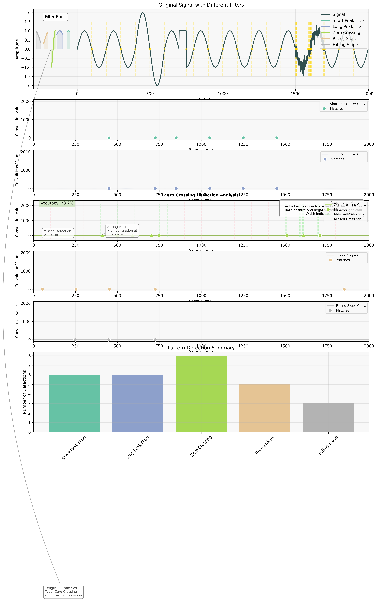

# Signal Convolution Exercise

This project demonstrates the concept of signal convolution using a sine wave signal and a filter extracted from the signal itself. The exercise shows how convolution can be used to detect patterns in signals.



The figure above shows:
1. **Top**: Original signal (black) with different filter patterns shown on the left
2. **Middle**: Individual convolution results for each filter type, with detected patterns marked
3. **Bottom**: Summary of pattern detections for each filter type

## Project Overview

The exercise consists of the following steps:

1. Signal Generation:
   - Creates a sine wave signal with 10 periods
   - Uses 200 samples per period for high resolution

2. Filter Creation:
   - Extracts a 30-sample filter from the first period peak
   - The filter is centered on the first peak of the sine wave

3. Convolution:
   - Performs convolution between the signal and the filter
   - Uses NumPy's convolve function with 'same' mode

4. Peak Detection:
   - Identifies peaks in the convolution result
   - Uses scipy.signal.find_peaks with appropriate distance parameter

5. Visualization:
   - Plots the original signal (green)
   - Shows the filter (blue)
   - Displays the convolution result (black)
   - Marks detected peaks (black dots)

## Requirements

- Python 3.10 or higher
- NumPy
- Matplotlib
- SciPy

## Usage

1. Follow the setup instructions in `INSTRUCTIONS.md`
2. Run the script:
   ```bash
   python convolution.py
   ```

## Output

The script will display a plot showing:
- The original sine wave signal
- The filter used for convolution
- The convolution result
- Detected peaks in the convolution result

It also prints information about:
- Signal length
- Filter length
- Convolution result length
- Number and locations of detected peaks